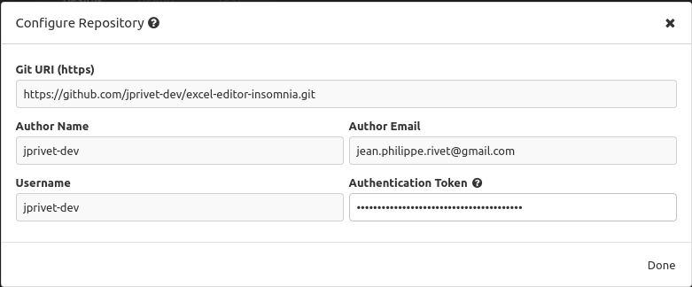

:toc: macro
:toc-title: Summary
:toclevels: 3
:numbered:

ifndef::env-github[:icons: font]
ifdef::env-github[]
:status:
:outfilesuffix: .adoc
:caution-caption: :fire:
:important-caption: :exclamation:
:note-caption: :paperclip:
:tip-caption: :bulb:
:warning-caption: :warning:
endif::[]

:back_to_top_target: top-target
:back_to_top_label: ⬆ Back to top
:back_to_top: <<{back_to_top_target},{back_to_top_label}>>

:main_title: Excel Editor Insomnia
:git_project_base: excel-editor
:git_project_api: {git_project_base}-api
:git_project_spa: {git_project_base}-spa
:git_project_insomnia: {git_project_base}-insomnia
:git_username: jprivet-dev
:git_url_api: https://github.com/{git_username}/{git_project_api}
:git_url_spa: https://github.com/{git_username}/{git_project_spa}
:git_url_insomnia: https://github.com/{git_username}/{git_project_insomnia}
:git_ssh_api: git@github.com:{git_username}/{git_project_api}
:git_ssh_spa: git@github.com:{git_username}/{git_project_spa}
:git_clone_ssh_api: git@github.com:{git_username}/{git_project_api}.git
:git_clone_ssh_spa: git@github.com:{git_username}/{git_project_spa}.git

:git_project_current: {git_project_insomnia}
:git_url_current: {git_url_insomnia}
:git_ssh_current: {git_ssh_insomnia}

// Releases
:project_release: v1.0.0

[#{back_to_top_target}]
= {main_title}

image:https://badgen.net/badge/release/{project_release}/blue[Project release,link=https://github.com/jprivet-dev/excel-editor-api/releases/tag/{project_release}]

toc::[]

== Presentation

=== SPA, API & Insomnia

Study of a complete application, with a {git_url_spa}[SPA (Angular)] and an {git_url_api}[API (Symfony)], which allows users to connect, and to be able, according to their rights, to import Excel data and modify them online.

|===
| Excel Editor SPA | {git_url_spa}
| Excel Editor API | {git_url_api}
| Excel Editor Insomnia | {git_url_insomnia}
|===

{back_to_top}

=== Diagrams

==== Global architecture

image::doc/img/excel-editor-architecture-diagram.png[]

{back_to_top}

== Required plugins

* Global Header: https://insomnia.rest/plugins/insomnia-plugin-global-headers

{back_to_top}

== Sync Insomnia with Git

. Install Insomnia: https://docs.insomnia.rest/insomnia/install
. Fork {git_url_insomnia} on your GitHub account
. Sync Insomnia with your fork : https://docs.insomnia.rest/insomnia/git-sync

In my case, I use the manual configuration of a remote repository. See https://docs.insomnia.rest/insomnia/git-sync#manually-set-up-a-remote-repository :

{back_to_top}

== Comments, suggestions?

Feel free to make comments/suggestions to me in the {git_url_current}/issues[Git issues section].

{back_to_top}

== License

"{main_title}" is released under the {git_url_current}/blob/main/LICENSE[*MIT License*]

---

{back_to_top}
