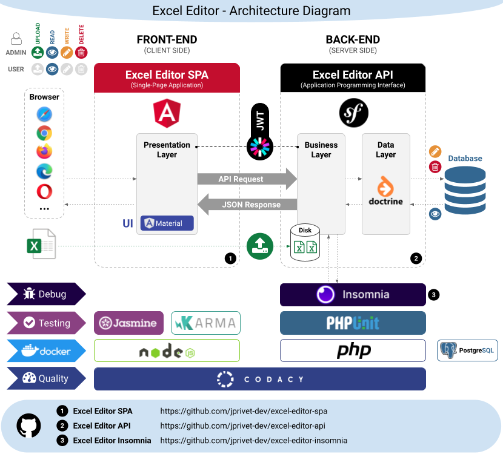

:toc: macro
:toc-title: Summary
:toclevels: 3
:numbered:

ifndef::env-github[:icons: font]
ifdef::env-github[]
:status:
:outfilesuffix: .adoc
:caution-caption: :fire:
:important-caption: :exclamation:
:note-caption: :paperclip:
:tip-caption: :bulb:
:warning-caption: :warning:
endif::[]

:back_to_top_target: top-target
:back_to_top_label: ⬆ Back to top
:back_to_top: <<{back_to_top_target},{back_to_top_label}>>

:main_title: Excel Editor Insomnia
:git_project_base: excel-editor
:git_project_api: {git_project_base}-api
:git_project_spa: {git_project_base}-spa
:git_project_insomnia: {git_project_base}-insomnia
:git_username: jprivet-dev
:git_url_api: https://github.com/{git_username}/{git_project_api}
:git_url_api_data: {git_url_api}/tree/main/data
:git_url_spa: https://github.com/{git_username}/{git_project_spa}
:git_url_insomnia: https://github.com/{git_username}/{git_project_insomnia}
:git_ssh_api: git@github.com:{git_username}/{git_project_api}
:git_ssh_spa: git@github.com:{git_username}/{git_project_spa}
:git_clone_ssh_api: git@github.com:{git_username}/{git_project_api}.git
:git_clone_ssh_spa: git@github.com:{git_username}/{git_project_spa}.git

:git_project_current: {git_project_insomnia}
:git_url_current: {git_url_insomnia}
:git_ssh_current: {git_ssh_insomnia}

// Releases
:project_release: v1.1.0

[#{back_to_top_target}]
= {main_title}

image:https://badgen.net/badge/release/{project_release}/blue[Project release,link=https://github.com/jprivet-dev/excel-editor-api/releases/tag/{project_release}]

toc::[]

== Presentation

=== SPA, API & Insomnia

Study of a complete application, with a {git_url_spa}[SPA (Angular)] and an {git_url_api}[API (Symfony)], which allows users to connect, and to be able, according to their rights, to import Excel data and modify them online.

|===
| Excel Editor SPA | {git_url_spa}
| Excel Editor API | {git_url_api}
| Excel Editor Insomnia | {git_url_insomnia}
|===

{back_to_top}

=== Diagrams

==== Global architecture

{back_to_top}

== How to use this repo with Insomnia ?

. Be sure to install the latest version of https://insomnia.rest/[Insomnia].
. Fork https://github.com/jprivet-dev/excel-editor-insomnia.git.
. Clone the project in Insomnia:
** Click on the *Create* menu, and choose *Git Clone*:
+
image::doc/img/step-1-menu-create-git-clone.png[]
** *Authenticate with GitHub* if you haven't already done so:
+

+

** Use the *HTTPS link to your fork* in *GitHub URI*:
+

** Click on the button *Clone*. You arrive at the *DESIGN* tab of the project homepage:
+

. Choose the *DEBUG* tab:
+

. Choose *Admin* environment:
+

+
TIP: You can use *Admin* or *User* environment.
. Click & Deploy *Authentication* folder, choose *login_check* request and click on *Send* button. You can retrieve a token:
+

. Click & Deploy *User* folder, choose *user* request and click on *Send* button. You have the user attached to the token:
+

. Click on the *Personal Projects* button to see the homepage with all projects:
+

{back_to_top}

== Upload Excel files

In the *Upload* folder, you can test the requests and upload the Excel files in the {git_url_api_data}[data] folder of the {git_url_api}[Excel Editor API]:

{back_to_top}

== Resources

* https://insomnia.rest/
* https://docs.insomnia.rest/
* https://medium.com/thefork/get-the-most-out-of-insomnia-to-effectively-test-your-api-8a81f1349ef6

{back_to_top}

== Comments, suggestions?

Feel free to make comments/suggestions to me in the {git_url_current}/issues[Git issues section].

{back_to_top}

== License

"{main_title}" is released under the {git_url_current}/blob/main/LICENSE[*MIT License*]

---

{back_to_top}
